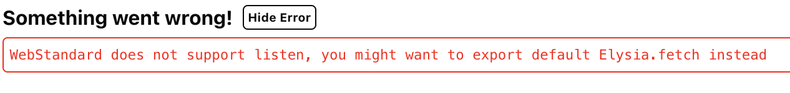

# Reproduction Repo: Elysia Eden and Vite + React in Monorepo not compatible

## The issue

When using `@elysia/eden` in React + Vite in a monorepo setup, following error is being thrown:

```
WebStandard does not support listen, you might want to export default Elysia.fetch instead
```


*[This is thrown in Elysia](https://github.com/elysiajs/elysia/blob/a35b26de4451da96f993917ca97cb95b5fc0401a/src/adapter/web-standard/index.ts#L202)*

## How to reproduce
1. start backend & frontend
1. Open frontend on localhost:3001
1. See error

## Setup

- Monorepo
- run `bun dev` in respective folders to start

### Backend
- Folder: `packages/backend`
- ElysiaJS using `bun create elysia packages/backend`
- [exported Elysia app](packages/backend/src/index.ts#L9) type via `export type App = typeof app`

### UI
- Folder: `packages/ui`
- React + Vite using [`create-tsrouter-app`](https://github.com/TanStack/create-tsrouter-app/tree/main/cli/create-tsrouter-app)
- Command used for creation: `bunx create-tsrouter-app@latest ui --template file-router --tailwind`
- set up eden treaty in [`apiClient.ts`](packages/ui/src/apiClient.ts)
- try to use treaty in [Rootroute](packages/ui/src/routes/index.tsx#L13)

